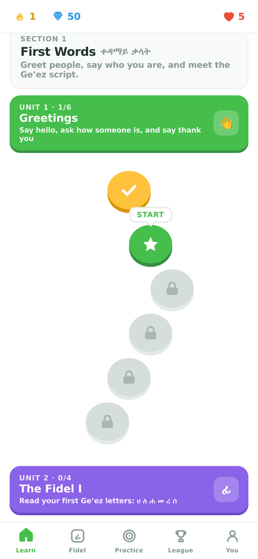
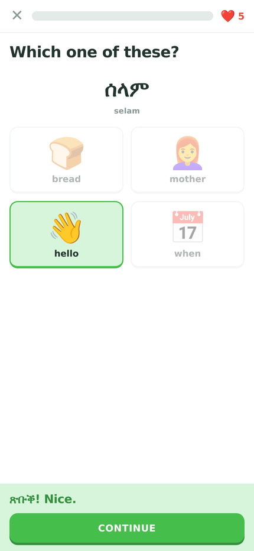
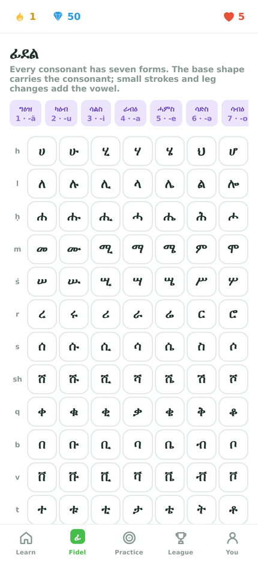
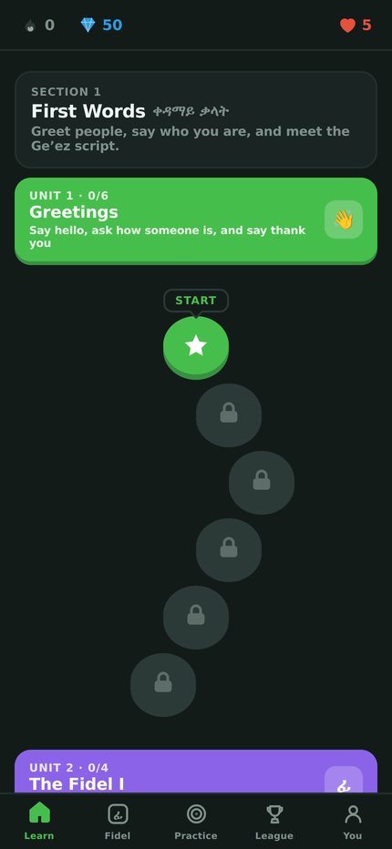

# DuoSemetics

A course app for **Tigrinya (ትግርኛ)** and the **Ge'ez script**, built in the shape of
a daily-streak language game: a winding lesson path, hearts, XP, a weekly league,
and spaced repetition underneath it all.

It runs as an installable web app, designed for iPhone 15 Pro Max first — 430×932pt,
Dynamic Island and home-indicator safe areas, standalone display, offline support.

<p>
  
  
  
  
</p>

## Install it on your iPhone

Whichever route you take, the last two steps are the same: open the URL in
**Safari** (only Safari can install to the Home Screen), then Share →
**Add to Home Screen**. It launches full-screen with its own icon and splash,
keeps working without a connection, and stores progress on the device.

**Over your own Wi-Fi — nothing leaves your network:**

```bash
npm install
npm run phone     # builds, then serves on http://192.168.x.x:4173
```

Open the `Network:` address it prints on the phone. Use `npm run phone` rather
than `npm run dev`: it serves a real production build, so what you see matches
what a deploy would serve.

Two honest limits to this route:

- **It does not work offline.** Service workers need a secure context — HTTPS, or
  `localhost` — and a plain `http://192.168.x.x` address is neither, so iOS will
  not register one. The app installs to the Home Screen and runs full-screen, but
  it needs your computer awake and on the same network *every* time you open it.
  Offline only starts working once it is served over HTTPS.
- **Progress is tied to the address.** See below.

**On GitHub Pages — a permanent URL, but a public one:**

The app is live at **https://rasraey.github.io/DuoSemetics/**, deployed by
`.github/workflows/deploy.yml` on every push to the default branch.

If Pages ever needs re-enabling, a repository admin does it once under
Settings → Pages → Source → **GitHub Actions**.

For a private permanent URL instead, `npm run build` and serve `dist/` anywhere
that supports password protection — it is a folder of static files.

### Is it saving?

**You → the storage card** answers that directly: whether writes are working,
when progress was last saved, how big it is, whether the app was opened as an
installed app or a browser tab, and whether the browser has promised not to
evict it.

Worth knowing on iPhone: **a Safari tab and a Home Screen app keep separate
storage.** A lesson played in the tab will not appear in the installed app. The
app warns about this on first run in a tab. Safari also clears storage for sites
left unused for about a week, which installing avoids.

### Moving between addresses without losing your streak

Progress lives in `localStorage`, which browsers scope to a single origin. A LAN
address and a hosted URL are different origins, so moving between them starts you
from zero unless you carry your progress across.

**You → Back up or move** does that: save a file (or copy the text), then restore
it on the other address. XP, streak, gems, crown levels and every word's strength
come across intact. Restoring asks you to confirm and refuses anything that is not
a DuoSemetics backup.

## Running it

```bash
npm install
npm run dev          # dev server
npm run build        # production build into dist/
npm run preview      # serve the build
npm run typecheck    # tsc, no emit
npm run lint         # oxlint
npm run icons        # regenerate icons + splash screens from scripts/icons.mjs
npm run phone        # build, then serve on the LAN for a phone to open
npm run check:content # generate every lesson and assert each one is solvable
npm run test:e2e     # build, then play two full lessons in Chromium at phone size
npm run test:stress  # mistakes, hearts running out, fidel, chests, reviews, practice
```

`.github/workflows/ci.yml` runs lint, typecheck, the content check and the browser
smoke test on every push. `.github/workflows/deploy.yml` publishes to GitHub Pages
and is manual — see above.

## What's in the course

**163 words** and **55 sentences** across 3 sections, 11 units and 61 path nodes,
plus the full **231-character Fidel** chart.

| Section | Units |
| --- | --- |
| 1 · First Words | Greetings · The Fidel I · People |
| 2 · Everyday Life | Numbers · Family · Food & Drink · The Fidel II |
| 3 · My World | Colours · At Home · Doing Things · Questions & Time |

Sentences stick to patterns a beginner can generalise from rather than one-off
phrases — subject + complement + copula (`ኣነ ተምሃራይ እየ።`), definite article +
adjective (`እቲ ማይ ዝሑል እዩ።`), object + verb (`ማይ እደሊ።`), and the
progressive with ኣሎ (`እንጀራ ይበልዕ ኣሎ።`).

## Exercise types

Ten, generated fresh each time a lesson is played:

- **Pick the picture** — a new word against four images
- **Multiple choice**, Tigrinya → English and English → Tigrinya
- **Listen and choose**
- **Word bank translation**, both directions
- **Type the translation**, graded leniently (typos and filler words forgiven)
- **Fill in the blank**
- **Match pairs** — a timed-feeling speed round that closes every lesson
- **Fidel: letter → sound**, **sound → letter**, and **pick the right order**

The last one is the one that actually teaches the abugida: given a base shape and a
target vowel, find the form that carries it, which forces attention onto the vowel
mark rather than the whole glyph.

## How the game works

**The lesson queue.** A wrong answer is pushed back three slots and the
denominator grows, so the progress bar only moves on exercises you have actually
got right. A lesson ends when you have learned the material, not after a fixed count.

**Hearts.** Five, one per mistake, one back every 30 minutes, refillable with gems.
Practice is the free way out: it never costs a heart, it opens even at zero, and
finishing a session hands one back — so running dry is a detour, not a wall. The
out-of-hearts sheet offers it directly. There is also an *Unlimited hearts* switch
in settings for anyone who finds them stressful.

**Streaks and XP.** A streak advances once per day; a missed day burns a streak
freeze if you have one, otherwise it resets. XP comes with a flawless bonus and a
speed bonus, and feeds a weekly league.

**Spaced repetition.** Every word carries a strength from 0–5. Correct answers move
it up one, wrong answers knock it down two, and the next due date follows the new
strength (4h → 1d → 3d → 1w → 1m). The Practice tab pulls from what is overdue and
from what you have recently got wrong.

**The league** runs entirely on your device. The rival learners are generated from a
seed derived from the week number — the app says so on the screen rather than
implying there are other users.

## Audio

No platform ships a Tigrinya (`ti`) speech voice. The app tries, in order: a `ti-*`
voice, then an Amharic (`am-*`) voice — a different language, but it shares the
Ge'ez script and most consonants, so it reads Tigrinya text far more usefully than
an English voice would — and then nothing at all.

When there is no voice, listening exercises become reading exercises against the
transliteration rather than silently pretending to play something. The Profile tab
states which of the three cases applies on the current device.

**This is the honest gap in the course.** Recorded audio from native speakers is what
it needs, and is the single biggest thing that would improve it.

## Layout notes for iPhone

- `viewport-fit=cover` plus `env(safe-area-inset-*)` throughout, so content clears
  the Dynamic Island and the home indicator without hard-coded offsets.
- `apple-mobile-web-app-status-bar-style: black-translucent`, with the top bar
  padded by `--sat` — the Profile tab has no top bar, so it owns that inset itself.
- Launch images at 1290×2796 for light and dark.
- Ge'ez text uses Noto Sans Ethiopic, falling back to **Kefa**, which ships with iOS —
  so the script renders correctly even offline on first launch.
- Interface text uses `ui-rounded`, which is SF Pro Rounded on Apple platforms.
- No double-tap zoom, no overscroll bounce, no text selection, no tap highlight.

## Project layout

```
src/
  data/        lexicon, sentences, Fidel tables, curriculum   (all content, no logic)
  engine/      generator, grading, SRS, progress store, RNG   (all logic, no React)
  audio/       synthesised sound effects, speech synthesis
  components/  screens and exercises
scripts/
  icons.mjs    regenerates every icon and splash from one SVG source
  smoke.mjs    drives a real browser through a full lesson
```

Content and logic are kept apart on purpose: adding a unit means editing
`data/curriculum.ts` and nothing else, and the generator decides how to drill it.

## Accuracy and scope

The Tigrinya here was written to be correct for a beginner course, favouring
sentence patterns that generalise and avoiding constructions where agreement is
easy to get subtly wrong. Transliteration is a learner-friendly scheme, not strict
academic romanisation (`ḥ` = ሓ, `ḵ` = ኸ, `ʕ` = ዓ, `t' ch' ts' p' q` = ejectives).

It is not a substitute for a speaker or a published course, and corrections from
native speakers are the most valuable contribution it could get. Dialect note: forms
here lean toward what is common in Eritrea and Tigray alike; where a greeting differs
by the gender of who you are addressing, both forms are taught.

## Privacy

Everything is stored in `localStorage` on the device. There is no account, no server,
no analytics, and no network request except the Google Fonts stylesheet. Backups are
plain JSON that never leave the device unless you send them somewhere yourself.
